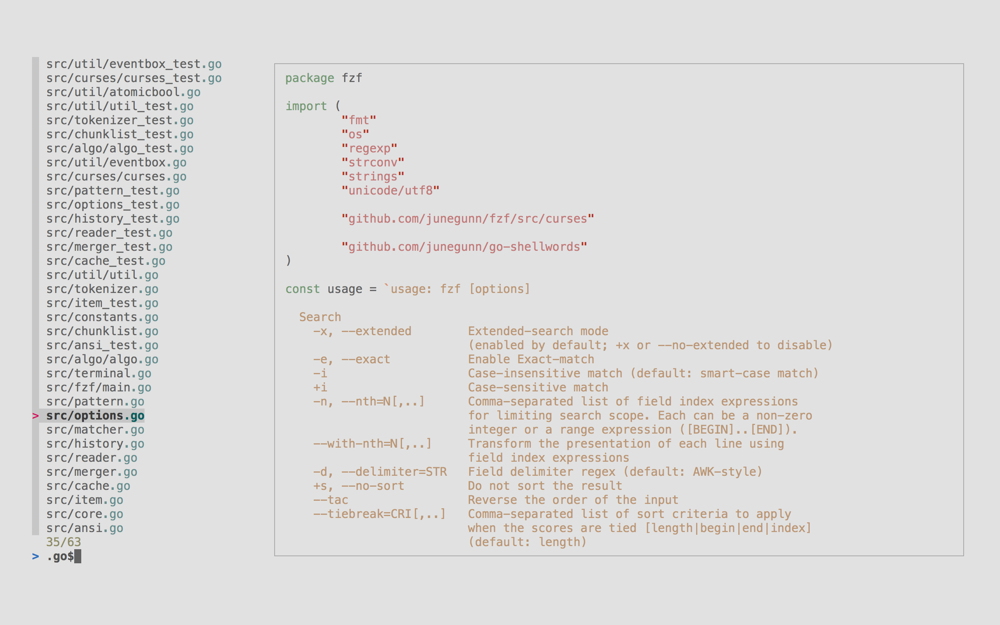

# A collection of useful tools for CLI

## Terminal

### Alacritty

- Config

  Alacritty looks for configuration files in:

  ```bash
  $XDG_CONFIG_HOME/alacritty/alacritty.toml
  $XDG_CONFIG_HOME/alacritty.toml
  $HOME/.config/alacritty/alacritty.toml # Recommended
  $HOME/.alacritty.toml
  ```

### Warp

### Kitty

- Install (Linux/Mac)

  ```bash
  curl -L https://sw.kovidgoyal.net/kitty/installer.sh | sh /dev/stdin
  ```

  kitty will be install to

  - `/Applications/kitty.app` on Mac
  - `~/.local/kitty.app` on Linux

- Add icon for kitty to taskbar on Linux

  ```bash
  # Create symbolic links to add kitty and kitten to PATH (assuming ~/.local/bin is in your system-wide PATH)
  ln -sf ~/.local/kitty.app/bin/kitty ~/.local/kitty.app/bin/kitten ~/.local/bin/

  # Place the kitty.desktop file somewhere it can be found by the OS
  cp ~/.local/kitty.app/share/applications/kitty.desktop ~/.local/share/applications/

  # If you want to open text files and images in kitty via your file manager also add the kitty-open.desktop file
  cp ~/.local/kitty.app/share/applications/kitty-open.desktop ~/.local/share/applications/

  # Update the paths to the kitty and its icon in the kitty desktop file(s)
  sed -i "s|Icon=kitty|Icon=/home/$USER/.local/kitty.app/share/icons/hicolor/256x256/apps/kitty.png|g" ~/.local/share/applications/kitty*.desktop
  sed -i "s|Exec=kitty|Exec=/home/$USER/.local/kitty.app/bin/kitty|g" ~/.local/share/applications/kitty*.desktop
  ```

- Change default icon to [kitty-icon](https://github.com/DinkDonk/kitty-icon) dark

  ```bash
  # Fedora
  curl https://raw.githubusercontent.com/DinkDonk/kitty-icon/main/kitty-dark.png -o ~/.local/kitty.app/share/icons/hicolor/256x256/apps/kitty.png
  gtk-update-icon-cache -f -t ~/.local/kitty.app/share/icons/hicolor
  ```

For more information, see [Install kitty](https://sw.kovidgoyal.net/kitty/binary/#install-kitty)

## Shell

### bash

### zsh

#### [oh-my-zsh][oh-my-zsh]: Framework for Zsh, comes with [plugins][on-my-zsh-plugins], [themes][oh-my-zsh-themes], functions, helpers

#### [Antidote][Antidote]: zsh plugin manager (successor of `Antibody` - successor of `Antigen`) - Cure to slow zsh loading time

#### Completion, suggestions & syntax highlight for zsh

- Completions (for a command)

  - [argc-completions](#argc-completions)
  - [zsh-users/zsh-completions][zsh-users/zsh-completions] ?

- Suggestions (from history)

  - [zsh-users/zsh-autosuggestions][zsh-users/zsh-autosuggestions]

- Syntax highlight
  - [zsh-users/zsh-syntax-highlighting][zsh-users/zsh-syntax-highlighting]
  - [zdharma-continuum/fast-syntax-highlighting][zdharma-continuum/fast-syntax-highlighting]
  - [z-shell/F-Sy-H][z-shell/F-Sy-H]

### fish

## Shell Plugins

### argc-completions

[Argc-completions][argc-completions]: Completions for any shell. Supports 1000+ commands. Automatically generate completion definition from help text and man page.

### [fzf][fzf]: A command-line fuzzy finder



- Key bindings for command-line[^fzf-key-bindings]:
  - `CTRL-T` - Get a list of files and directories
  - `CTRL-R` - Get a list of command history
  - `ALT-C` - Get a list of directories
- Fuzzy Complete for files/directories[^fzf-fuzzy-completion]:
  - `**<TAB>`: `COMMAND [DIRECTORY/][FUZZY_PATTERN]**<TAB>`

## Shell Prompt

### Starship: Cross-shell Prompt

See [Starship](./starship.md)

## CLI tools

### File navigate

#### `broot`[^broot]: A better way to navigate directories 🌟🌟🌟


broot can replace a lot of CLI tools (e.g. `ls`, `cd`, `tree`, `df`, `find`...)

- Config
  - The default configuration file location is `~/.config/broot/conf.toml`
  - [How to config Broot?](https://dystroy.org/broot/conf_file/)

### Data process

### `sed`, `awk`, `grep`

#### `jq`[^jq]: The original _JSON_ processor 🌟🌟

#### `jq` clones:

- `jaq`[^jaq]: Rust clone
- `gojq`[^gojq]: Go clone

#### `yq`[^yq]: _YAML_ (JSON, XML, CSV, TOML, ...) processor 🌟🌟

#### `xq`[^xq]: XML, _HTML_ processor

#### `fx`[^fx]: Interactive _JSON_/YAML viewer & processor 🌟🌟🌟


[^broot]: <https://github.com/Canop/broot>
[^jq]: <https://github.com/jqlang/jq>
[^jaq]: <https://github.com/01mf02/jaq>
[^gojq]: <https://github.com/itchyny/gojq/>
[^yq]: <https://github.com/mikefarah/yq>
[^xq]: <https://github.com/sibprogrammer/xq>
[^fx]: <https://fx.wtf/>

[oh-my-zsh]: https://ohmyz.sh/
[on-my-zsh-plugins]: https://github.com/ohmyzsh/ohmyzsh/wiki/Plugins
[oh-my-zsh-themes]: https://github.com/ohmyzsh/ohmyzsh/wiki/Themes
[Antidote]: https://github.com/mattmc3/antidote
[argc-completions]: https://github.com/sigoden/argc-completions
[fzf]: https://github.com/junegunn/fzf
[zsh-users/zsh-completions]: https://github.com/zsh-users/zsh-completions/
[zsh-users/zsh-autosuggestions]: https://github.com/zsh-users/zsh-autosuggestions
[zsh-users/zsh-syntax-highlighting]: https://github.com/zsh-users/zsh-syntax-highlighting
[zdharma-continuum/fast-syntax-highlighting]: https://github.com/zdharma-continuum/fast-syntax-highlighting
[z-shell/F-Sy-H]: https://github.com/z-shell/F-Sy-H

[^fzf-fuzzy-completion]: <https://github.com/junegunn/fzf?tab=readme-ov-file#fuzzy-completion-for-bash-and-zsh>
[^fzf-key-bindings]: <https://github.com/junegunn/fzf?tab=readme-ov-file#key-bindings-for-command-line>
