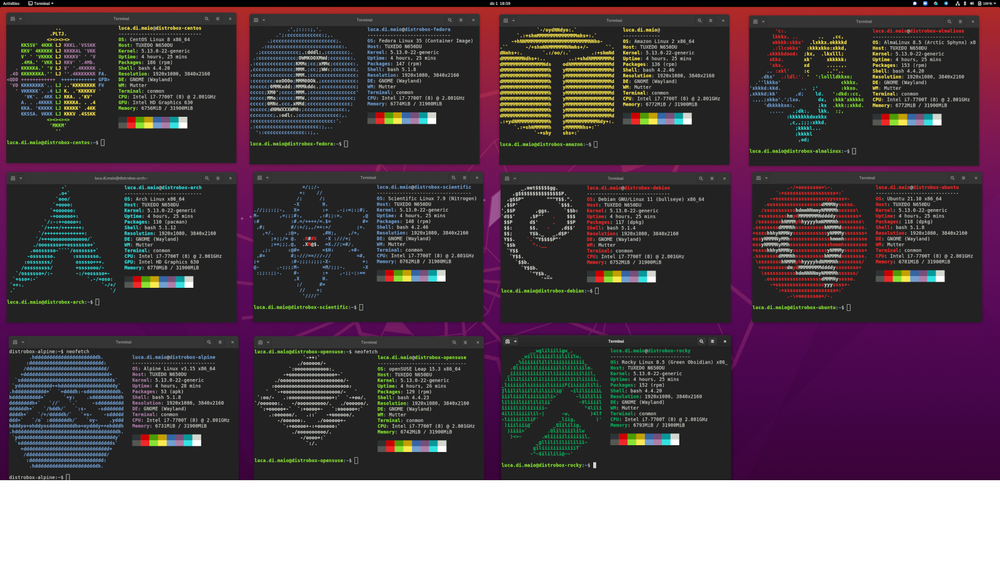
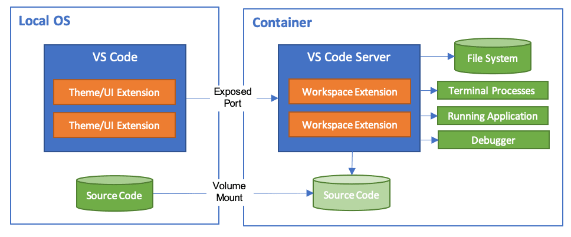
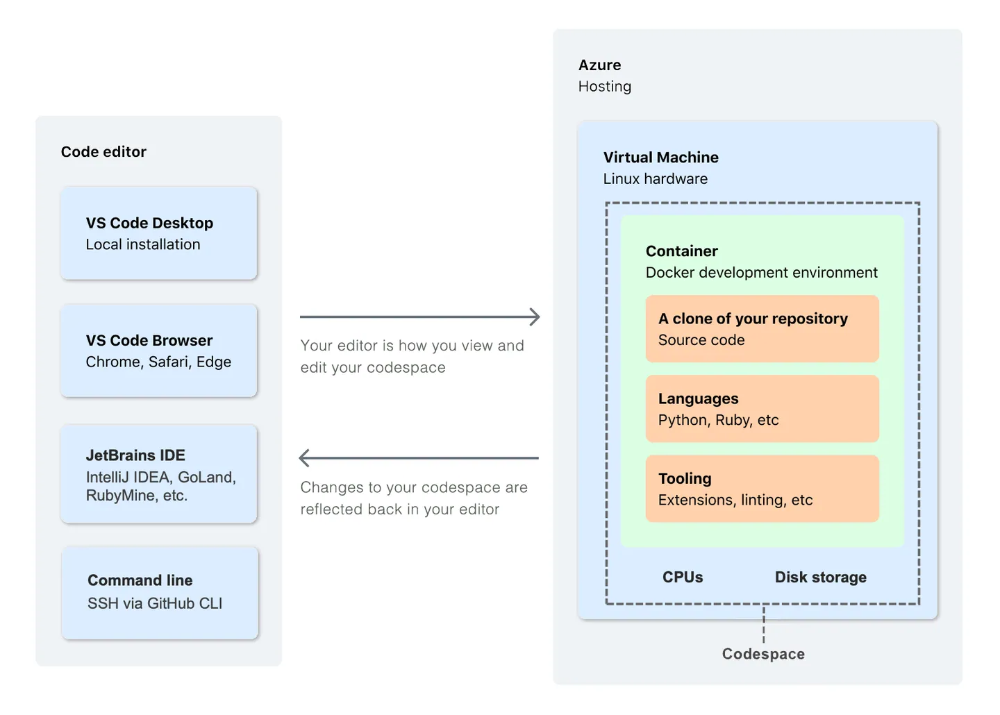
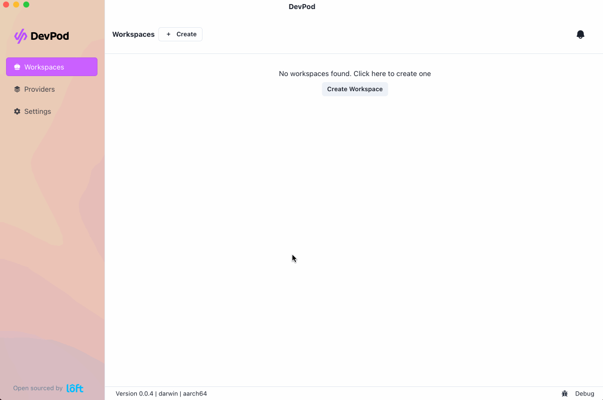

# Developing inside containers

## distrobox

distrobox[^distrobox]: Use any linux distribution inside your terminal

## toolbox

toolbox[^toolbox] is a tool for Linux operating systems, which allows the use of containerized command line environments

This is usedful for OSTree based operating systems like Fedora CoreOS and Silverblue. The intention of these systems is to discourage installation of software on the host, and instead install software as (or in) containers

Toolbox solves these problem by providing a fully mutable container within which one can install their favorite development and debugging tools, editors and SDKs.

## devcontainers

development container (dev container)
: a dev container allows you to use a container as a full-featured development environment

devcontainers spec
: An open specification for enriching containers with development specific content and settings.

### Tools and services support the Development Container Specification

#### Editors

- VS Code & its Dev Containers extension[^vscode-dev-container]
  
- JetBrain's IDE: IntelliJ, Goland[^goland-dev-container]...

#### Tools

- Jetpack.io[^jetpack.io] `devbox`[^devbox]: Instant, easy, and predictable development environments (Nix-based, no container while developing)
- cachix `devenv`[^devenv]: Fast, Declarative, Reproducible, and Composable Developer Environments using Nix

#### Services

- GitHub Codespaces

  

- CodeSandbox[^codesandbox]
- DevPod[^devpod]: Codespaces but open-source, client-only and un-opinionated: Works with any IDE and lets you use any cloud, kubernetes or just localhost docker.

  

[^distrobox]: <https://github.com/89luca89/distrobox>
[^toolbox]: <https://github.com/containers/toolbox>
[^goland-dev-container]: <https://www.jetbrains.com/help/go/connect-to-devcontainer.html>
[^vscode-dev-container]: <https://code.visualstudio.com/docs/devcontainers/containers>
[^jetpack.io]: <https://www.jetpack.io/>
[^devenv]: <https://github.com/cachix/devenv>
[^codesandbox]: <https://codesandbox.io/>
[^devpod]: <https://github.com/loft-sh/devpod>
[^devbox]: <https://www.jetpack.io/devbox>
