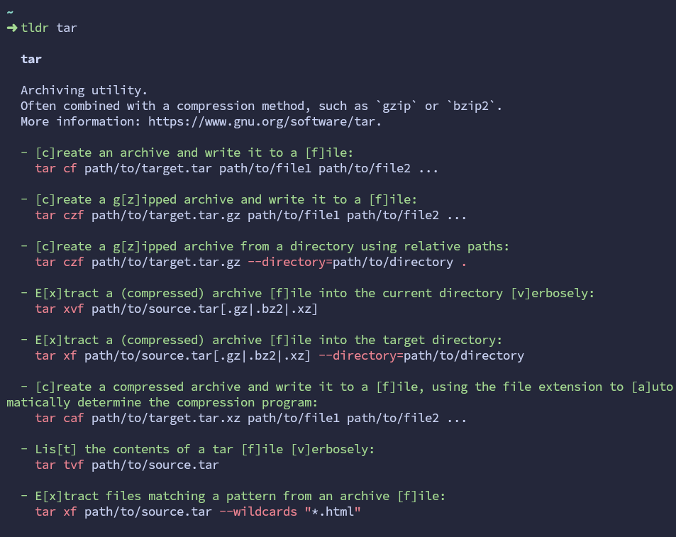
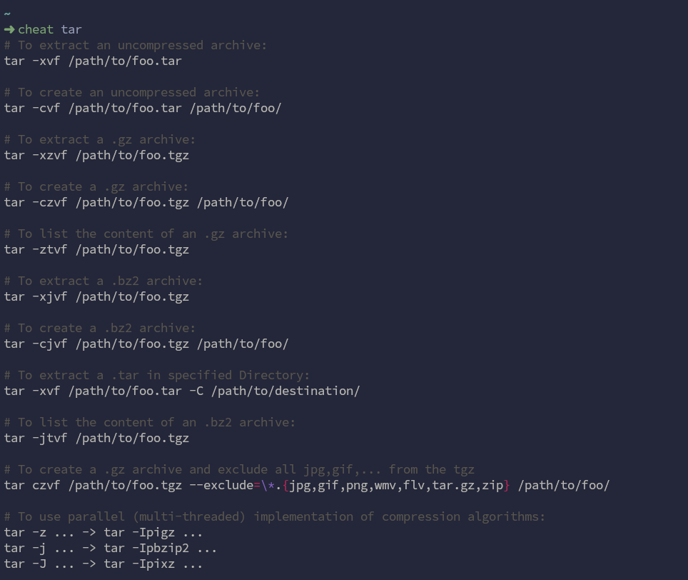
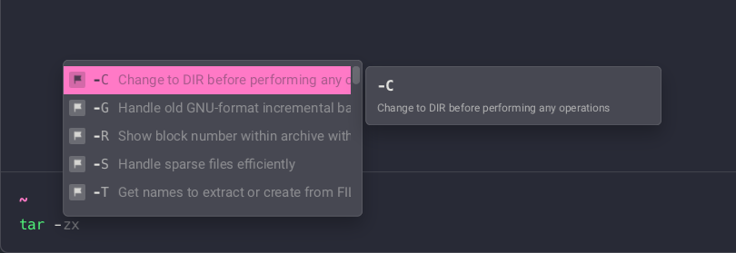
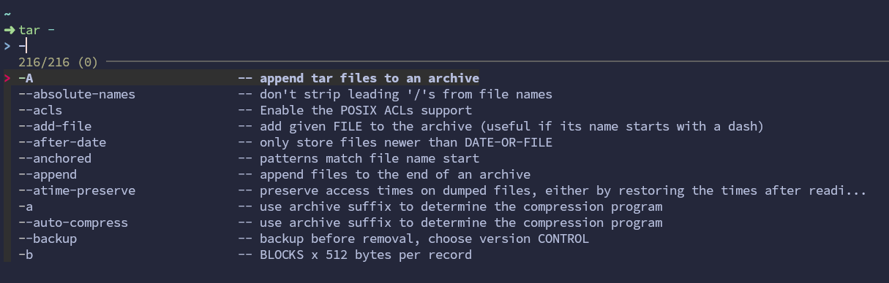
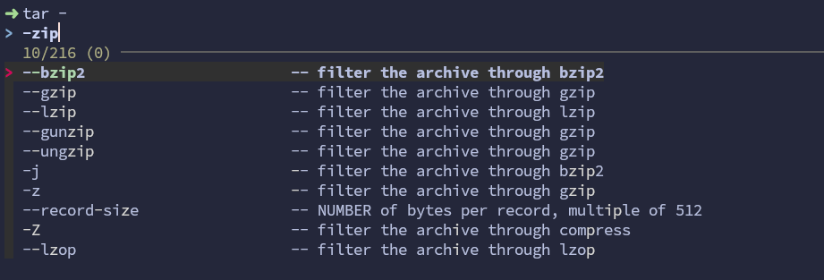
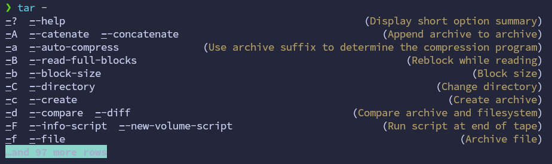

# Don't read the docs (of an CLI tool) without trying

## Tools

### tldr

`tldr-pages`[^tldr-pages]: Simplified and community-driven `man` pages

`tldr-pages` for a CLI tool can be available for many platforms, e.g. `common`, `linux`, `osx`, `windows`, ...

`tldr-pages` can be accessed in a lot of ways[^tldr-clients]:

- Via a PWA: [tldr.inbrowser.app](https://tldr.inbrowser.app/)
- Via a Browser extension: [piraces/tldr-extension-browser](https://github.com/piraces/tldr-extension-browser)
- Via a CLI tool:
  - [tldr-c-client](https://github.com/tldr-pages/tldr-c-client): The original client, written in C
  - [tldr-python-client](https://github.com/tldr-pages/tldr-python-client): Python command-line client for tldr pages (This one is distributed for Linux distros)
  - [tlrc](https://github.com/tldr-pages/tlrc): A new official tldr client written in Rust
- As a PDF ebook in many languages[^tldr-latest-release]

`tldr` (`tl;dr`)
: short for `too long; didn't read` (also occasionally `don't read`)
: (_internet slang_) used to introduce a summary of an online post or news article[^tdlr-wikipedia]

### cheat

cheat[^cheat]: cheatsheats for `*nix` commands that are used frequently, but not frequently enough to be remembered

### xny

xny[^xny]: A way to use [Learn X in Y Minutes][x-in-y] on the command line.

## Terminal/shell completion feature

### Warp's completion

### zsh completion

zsh completion with fuzzy search

### fish completion

### The new terminal of JetBrain's IDEs (e.g. GoLand)

For more information, see its [Introduce Blog][jetbrain-new-terminal]

[x-in-y]: https://learnxinyminutes.com/
[jetbrain-new-terminal]: https://blog.jetbrains.com/idea/2024/02/the-new-terminal-beta-is-now-in-jetbrains-ides

[^tldr-pages]: <https://github.com/tldr-pages/tldr>
[^xny]: <https://github.com/YesSeri/xny-cli>
[^tldr-clients]: <https://github.com/tldr-pages/tldr/wiki/tldr-pages-clients>
[^tdlr-wikipedia]: <https://en.wikipedia.org/wiki/TL;DR>
[^tldr-latest-release]: <https://github.com/tldr-pages/tldr/releases/latest>
[^cheat]: <https://github.com/cheat/cheat>
