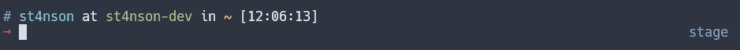
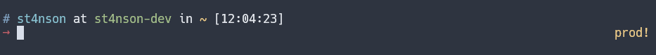
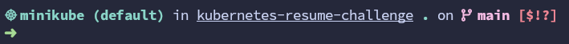

# Kubernetes - Tools, Tips & Tricks

## k9s

k9s[^k9s]: Kubernetes CLI To Manage Your Clusters In Style!


### Basic usage

When first opened, `k9s` show the list of pods.

From there you can:

- Change the selected pod (`Up`, `Down`),

  - then doing actions with that selected pod (by pressing the key bindings in blue color), e.g.
    - `Describe` that pod, by pressing `d`
    - `Logs`, show logs of all containers of that pod, by pressing `l`
    - ...
    - View that selected pod, by pressing `Enter`

- Change the namespace (by pressing the key bindings in pink color)

  - to `all`
  - to `default` (by default, `k9s` use `default` namespace)

- Change to another list (resource)
  - List all the resources, by pressing `Ctrl +A`
  - Change to the view for that resource, by pressing `Enter`

| Action                            | Key Binding   | Command | Note                                                          |
| --------------------------------- | ------------- | ------- | ------------------------------------------------------------- |
| Change the selected resource      | `Up` - `Down` |         |                                                               |
| View (the selected resource)      | `Enter`       |         | Available for any selected resource                           |
| Back                              | `Esc`         |         |                                                               |
| Quit K9s                          | `Ctrl + C`    |         |                                                               |
| Help                              | `?`           |         | Available at any view, change depend on which view is showing |
| Show all available resource alias | `Ctrl + A`    |         | 1. `Up`/`Down`; 2. `Enter`                                    |

## Headlamp

Headlamp[^headlamp] (a CNCF Sandbox project[^headlamp-cncf]): A Kubernetes web UI that is fully-featured, user-friendly and extensible


[^k9s]: <https://github.com/derailed/k9s>
[^headlamp]: <https://github.com/headlamp-k8s/headlamp>
[^headlamp-cncf]: <https://www.cncf.io/projects/headlamp/>

## Tips & Tricks

### Make aliases for `kubectl`

- Just a simple alias `k` for `kubectl`

  - For zsh

    ```bash
    alias k="kubectl"
    ```

- Use shell plugin that provides a lot of aliases, e.g.
  - For zsh:
    - oh-my-zsh's plugin: [kubectl](https://github.com/ohmyzsh/ohmyzsh/tree/master/plugins/kubectl)

### Show cluster information in shell prompt

- oh-my-zsh plugin [kubectx](https://github.com/ohmyzsh/ohmyzsh/tree/master/plugins/kubectx)
  
  

- Use [starship](https://starship.rs/) prompt, with its [command for Kubernetes](https://starship.rs/config/#kubernetes)
  

- Use [fish shell](https://fishshell.com/), which show it by default
  

### Add shell completion for `kubectl`
