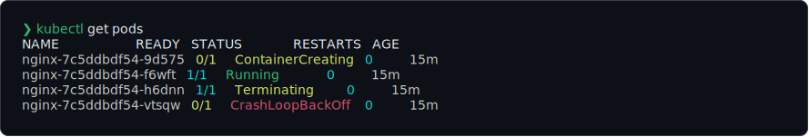
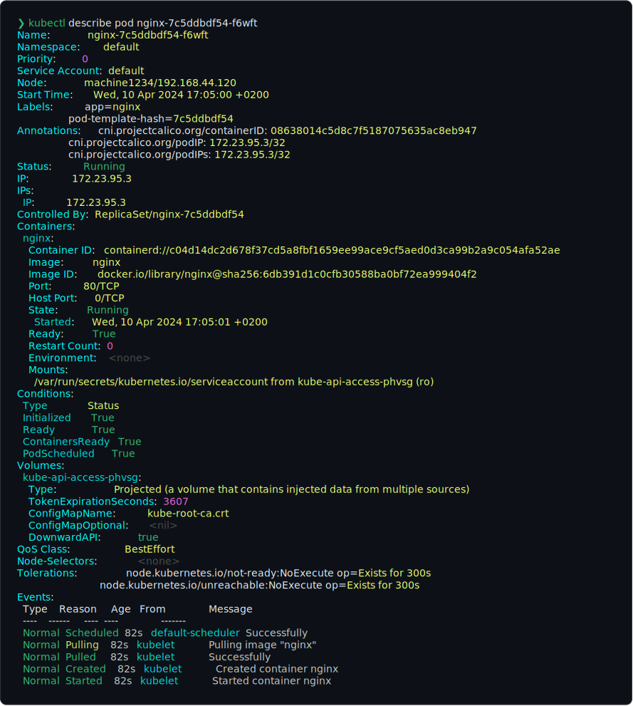

# Kubernetes - Tools, Tips & Tricks

## k9s

[k9s]: ../Kubernetes CLI To Manage Your Clusters In Style!


<details>
<summary>Usage</summary>

When first opened, `k9s` show the list of pods.

From the `Pods` view, you can:

- Change the selected pod (`Up`, `Down`),

  - then doing actions with that selected pod (by pressing the key bindings in blue color), e.g.
    - `Describe` that pod, by pressing `d`
    - `Logs`, show logs of all containers of that pod, by pressing `l`
    - ...
    - View that selected pod, by pressing `Enter`

- Change the namespace (by pressing the key bindings in pink color)

  - to `all` by pressing `0`
  - to `default` by pressing `1` (by default, `k9s` use `default` namespace)

- Change to another list (resource)

  - List all the resources, by pressing `Ctrl +A`
  - Change to the view for that resource, by pressing `Enter`

  for example: change back to the default view - `Pods`

  - `Ctrl + A`
    - `Down`s to select `pods` (the 2nd one)
    - `Enter`
  - Press `:` to enter `command mode`
    - Type in the command for pod: `pod` (or any of `po,pod,pods,v1/pods` - showed in `Ctrl + A`)

| Action                            | Key Binding   | Command | Note                                                                                             |
| --------------------------------- | ------------- | ------- | ------------------------------------------------------------------------------------------------ |
| Change the selected resource      | `Up` - `Down` |         |                                                                                                  |
| View (the selected resource)      | `Enter`       |         | Available for any selected resource                                                              |
| Back                              | `Esc`         |         |                                                                                                  |
| Quit K9s                          | `Ctrl + C`    |         |                                                                                                  |
| Help                              | `?`           |         | Available at any view, change depend on which view is showing                                    |
| Show all available resource alias | `Ctrl + A`    |         | 1. `Up`/`Down`; 2. `Enter`<br>(to close the `Aliases` view: use `Ese` or press `Ctrl + A` again) |

</details>

## Headlamp

Headlamp[^headlamp] (a CNCF Sandbox project[^headlamp-cncf]): A Kubernetes web UI that is fully-featured, user-friendly and extensible


[k9s]: https://github.com/derailed/k9s

[^headlamp]: <https://github.com/headlamp-k8s/headlamp>
[^headlamp-cncf]: <https://www.cncf.io/projects/headlamp/>

## Tips & Tricks

### Use the right version of `kubectl` for each cluster/project with `asdf`

You must use a `kubectl` version that is compatible with your cluster control plane (`kube-apiserver`).

<details>
<summary>Why</summary>

`kubectl` is supported within one minor version (older or newer) of `kube-apiserver`.

e.g.

- `kube-apiserver` is at 1.30
- `kubectl` is supported at 1.31, 1.30, and 1.29

For more information, see

- [Version Skew Policy](https://kubernetes.io/releases/version-skew-policy/)
- [kubectl](https://kubernetes.io/releases/version-skew-policy/#kubectl)
- [Special Interest Group (SIG) Release's Repository Notes](https://github.com/kubernetes/sig-release/tree/master/releases)

</details>

<details>
<summary>How?</summary>

See the demo at [asdf-demo repository](https://github.com/lethang7794/asdf-demo)

</details>

### Make aliases for `kubectl`

- Just a simple alias `k` for `kubectl`

  - For zsh

    ```bash
    alias k="kubectl"
    ```

- Use shell plugin that provides a lot of aliases, e.g.

  - oh-my-zsh's plugin [kubectl](https://github.com/ohmyzsh/ohmyzsh/tree/master/plugins/kubectl)
    Some useful aliases the plugin adds: `k`, `kaf`, `kga`. For the full lists, see [kubectl.plugin.zsh | ohmyzsh](https://github.com/ohmyzsh/ohmyzsh/blob/master/plugins/kubectl/kubectl.plugin.zsh).

  - If you want more, [kubectl-aliases] add 800 aliases, see the [full lists](https://github.com/ahmetb/kubectl-aliases/blob/master/.kubectl_aliases) and the [syntax explanation](https://github.com/ahmetb/kubectl-aliases/tree/master?tab=readme-ov-file#syntax-explanation)

### Show cluster information in shell prompt

- oh-my-zsh plugin [kubectx](https://github.com/ohmyzsh/ohmyzsh/tree/master/plugins/kubectx)
  
  

- Use [starship](https://starship.rs/) prompt, with its [command for Kubernetes](https://starship.rs/config/#kubernetes)
  

- Use [fish shell](https://fishshell.com/), which show it by default
  

### Add shell completions for `kubectl`

<details>
<summary>Configuration for completion</summary>

- [kubectl autocomplete | kubectl Quick Reference](https://kubernetes.io/docs/reference/kubectl/quick-reference/#kubectl-autocomplete)

- [kubectl completion | kubectl Commands](https://kubernetes.io/docs/reference/generated/kubectl/kubectl-commands#completion)

  - for macOS: <https://kubernetes.io/docs/tasks/tools/install-kubectl-macos/#enable-shell-autocompletion>

  - for linux: <https://kubernetes.io/docs/tasks/tools/install-kubectl-linux/#enable-shell-autocompletion>

  - for windows: <https://kubernetes.io/docs/tasks/tools/install-kubectl-windows/#enable-shell-autocompletion>

</details>

### Add color to `kubectl` output with `kubecolor`

[kubecolor] colorizes your `kubectl` command output and does nothing else.

You can use `kubecolor` as a complete alternative of `kubect`





<details>
<summary>Configuration</summary>

- zsh

  ```bash
  # .zshrc
  alias k="kubectl"

  if [ "$(command -v kubecolor)" ]; then
    alias kubectl="kubecolor"
    compdef kubecolor=kubectl
  fi
  ```

- fish

  ```bash
  # ~/.config/fish/config.fish
  if status is-interactive
    abbr --add k kubectl # https://fishshell.com/docs/current/cmds/abbr.html

    if  command -v kubecolor &>/dev/null
        alias kubectl=kubecolor # https://fishshell.com/docs/current/cmds/alias.html

        # make kubecolor inherit completions from kubectl # https://fishshell.com/docs/current/cmds/complete.html
        complete -c kubecolor -w kubectl
    end
  end
  ```

  </details>

### Switch between contexts (cluster) with `kubectx`

[kubectx]: ../a tool to switch between contexts (clusters) on `kubectl` faster.


### Switch between namespaces with `kubens`

[kubens]: ../a tool to switch between Kubernetes namespaces (and configure them for `kubectl`) easily.


### Switch between contexts/namspace with `kubeswitch`

[kubeswitch]: ../kubectx for operators, treat clusters as cattle, not pets.


[kubectl-aliases]: https://github.com/ahmetb/kubectl-aliases
[kubecolor]: https://github.com/kubecolor/kubecolor
[kubens]: https://github.com/ahmetb/kubectx
[kubectx]: https://github.com/ahmetb/kubectx
[kubeswitch]: https://github.com/danielfoehrKn/kubeswitch
